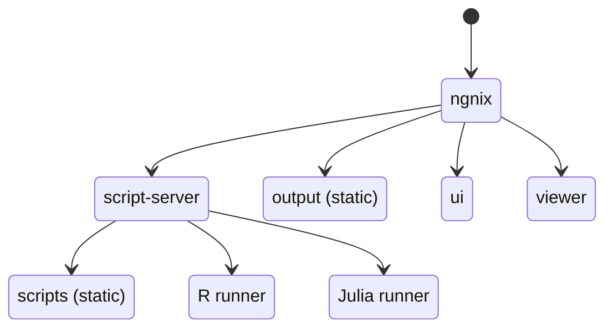
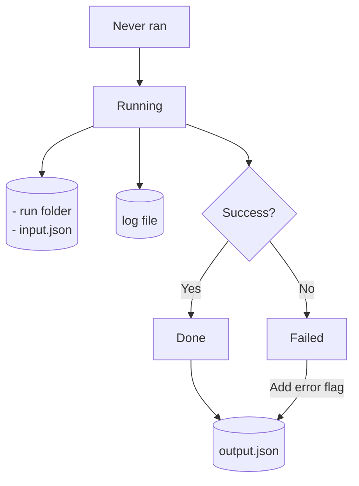
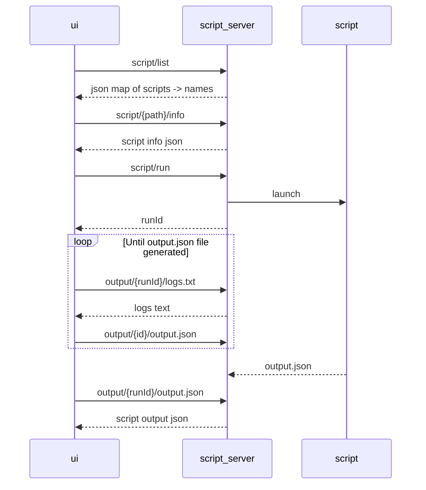
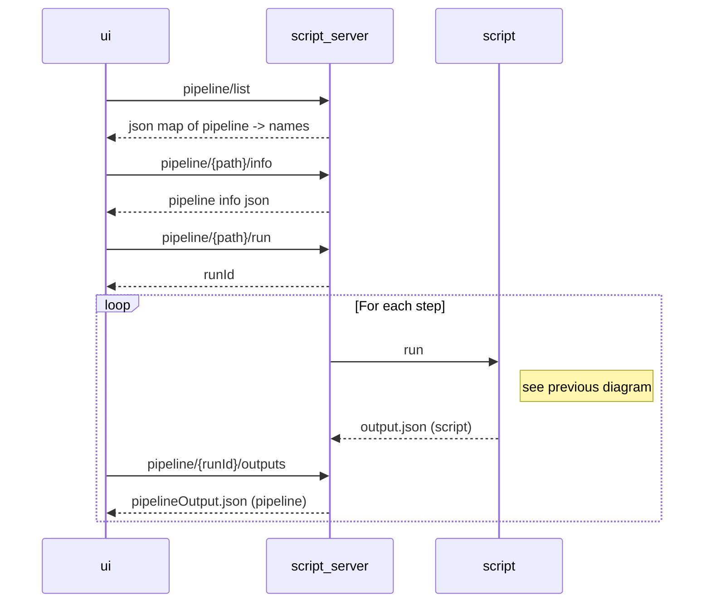

# Developer documentation

## Contributing

If you wish to contribute code to this pipeline engine, please let us know at web@geobon.org.

The recommended method is to setup an instance of BON in a Box somewhere you can easily play with the script files, using the local or remote setup in the user documentation. You can create a branch or fork to save your work. Once complete, open a pull request to this repository. The pull request will be peer-reviewed before acceptation.

## Getting the code

The code in this repository runs an engine, but the engine needs content! Here are the steps to start the server in development mode with the BON in a Box scripts and pipelines:

0. docker and docker compose must be installed.
1. Clone this repo: `git clone git@github.com:GEO-BON/bon-in-a-box-pipeline-engine.git pipeline-engine`
2. `cd pipeline-engine`
3. Clone the BON in a Box repo (or any compatible repo of your choice) **into the pipeline-repo folder**: `git clone git@github.com:GEO-BON/bon-in-a-box-pipelines.git pipeline-repo`
4. Create a runner.env file as per [user instructions](https://geo-bon.github.io/bon-in-a-box-pipeline-engine/how_to_install.html#running-the-servers-locally).
5. `cd ..`
6. Pull the pre-compiled images: `./dev-server.sh pull`

## IDE setup

For the global project, Visual Studio Code. Recommended extensions:

- Git graph
- Markdown Preview Mermaid
- Mermaid Markdown Syntax Highlighting

For the script-server (Kotlin code), IntelliJ Idea. Note that on Linux there will be an ownership conflict between gradle files generated by the development docker and those from the IDE. To solve this, make sure to stop the dockers and run `sudo chown -R <yourinfo>:<yourinfo> . ` before running the tests in IntelliJ.

## Launching the dockers in development mode

1. Build the remaining images: `./dev-server.sh build`

2. Start the development server: `./dev-server.sh up`
    - If there is a container name conflict, run `./dev-server.sh clean`

This command enables:

- OpenAPI editor at http://localhost/swagger/
- UI server: React automatic hot-swapping
- Script-server: Kotlin hot-swapping by launching [./script-server/hotswap.sh](../script-server/hotswap.sh)
- NGINX: [http-proxy/conf.d/ngnix.conf](../http-proxy/conf.d/ngnix.conf) will be loaded

Once in a while you should use `docker compose -f compose.yml -f compose.dev.yml pull` to have the latest base images.

## Releasing a server version

The servers are versionned by date of build of the docker image. One can check the version in the version tab of the UI.

### Creating a staging build
1. Create a branch that ends with "staging" from the head of the main branch.
2. Merge your changes to that branch. The docker hub GH action will trigger for branch main and any branch with name ending by "staging". The branch name is appended to the tag of the docker image. See
    - [.github/workflows/docker_script-server.yml](.github/workflows/docker_ui.yml)
    - [.github/workflows/docker_ui.yml](.github/workflows/docker_ui.yml)
3. **Caveat:** this only compiles the image where the paths were modified. For example, if `viewer` folder is modified, only the gateway will be rebuilt. However, the server will look for both images with the same prefix. In this case `script-server-staging` might not exist, or might be outdated. It is possible to launch the build of the script-server manually to make sure it exists and is up to date.
    1. On github website, navigate to the Actions tab
    2. open the desired action
    3. Click on the arrow next to "run workflow"
    4. Select the desired staging branch
    5. Run workflow
    6. Wait for completion
4. It is now possible to test the staging prod servers by running `./server-up.sh <branchname>`. The launch script will look for this special tag in the docker hub.For example, `./server-up.sh staging` will download and use both "gateway-staging" and "script-server-staging" images.
5. Send the above command to a few beta users.

### Public release
The changes are live as soon as they are merged to main branch: the dockers are built, pushed to [geobon's docker hub](https://hub.docker.com/r/geobon/bon-in-a-box), and next time someone starts the server, the new dockers will be pulled.

### Debugging prod servers

Yes, we all know problems occur in production that do not happen in dev mode. So in order to build and test production dockers locally, do the following:

1. In pipeline-repo folder, delete the .server folder.
2. Create a symbolic link from .server to the parent: `ln -s ../ .server`
3. Build the server with `.server/prod-server.sh command build`
4. Then run it with `.server/prod-server.sh command up`

   (`.server/prod-server.sh clean` might be needed if you get the usual name conflict error)
5. Stop the process with ctrl+c unless you used -d option in the previous command.

_Warning: Undo this by removing the symlink if you are to use `./server-up.sh` for a regular launch of the production servers, otherwise it will checkout files in your parent pipeline engine repo though the symlink._

## Microservice infrastructure

- ui and viewer: React front-end. In production, those are served statically in the NGINX gateway.
- script-server: Running scripts and pipeline orchestration
- R runner: Docker dedicated to runs R code, with most relevant packages pre-installed
- Julia runner: Docker dedicated to runs Julia code

In addition to these services,

- [scripts](../scripts/) folder contains all the scripts that can be run.
- [output](../output/) folder contains all scripts result.

## Script lifecycle & artifacts

## OpenAPI specification

The [OpenApi specification file](../script-server/api/openapi.yaml) is used by the UI to launch runs and track them until completion.

### Single-script scenario

### Pipeline scenario

Every second, the UI polls for:

- pipelineOutput.json from the pipeline, to get the output folders of individual scripts. Stops polling when pipeline stops.
- logs.txt of individual scripts, for realtime logging, only if log section is opened. Stops when individual script completes, or when log section closed.
- output.json of individual scripts, to know when script completes and display its outputs. Stops when script stops.

### Editing the OpenAPI specification of the script-server

1. Using http://localhost/swagger, edit the specification.
2. Copy the result to [script-server/api/openapi.yaml](../script-server/api/openapi.yaml)
3. Use [ui/BonInABoxScriptService/generate-client.sh](../ui/BonInABoxScriptService/generate-client.sh) and [script-server/generate-server-openapitools.sh](../script-server/generate-server-openapitools.sh) to regenerate the client and the server.
4. Merge carefully, not all generated code is to be kept.
5. Implement the gaps.

## Debugging signal forwarding

Since runner-r and runner-julia run in a separate docker, when the user stops the pipeline, the signal must go from the script-server, to the runner, to the running script. Docker does not allow this by default, this is why we save the PID in a file and use a separate exec command to kill the process.

The PID file is called `.pid` and is located in the output folder of the run. It is deleted when the script completes. For details, see [ScriptRun.kt](./script-server/src/main/kotlin/org/geobon/script/ScriptRun.kt).
