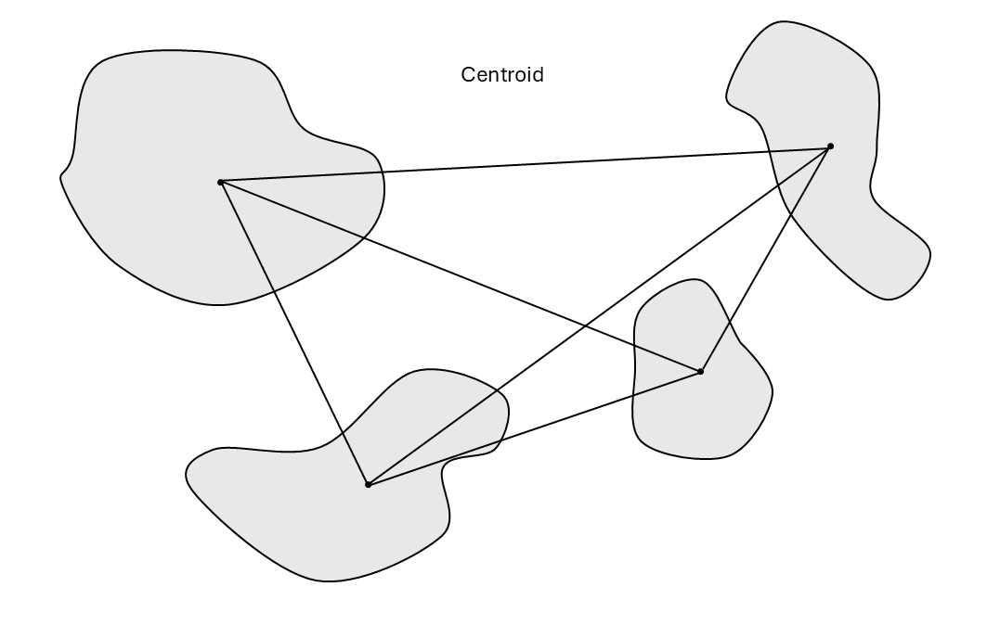

# Protected Connected Index
### Author(s): Jory Griffith
#### Reviewed by:

## Introduction

The Protected Connected Index (ProtConn) is a component indicator in the Global Biodiversity Framework (GBF). ProtConn measures the percent of a given country or region that is conserved and managed through well-connected protected areas. This is an important indicator for assessing progress towards goals A and Target 3 of the GBF, which aim to have 30% of land area protected by a network of well-connected protected areas by 2030.

## 'Use Case'/Context

ProtConn can be used to assess current progress towards the goals outlined in the introduction and for protected area planning and design.

## Pipeline limitations

- On larger datasets, the pipeline is slow and uses a lot of memory
- The pipeline does not take into account landscape resistance (ie. whether areas between protected areas are easily traversed by species)

## Before you start

To use this pipeline, you’ll need a WDPA API key. If you would like to run the pipeline with custom protected area data, ensure your data is in GeoPackage format and use the `ProtConn Analysis with custom PAs` pipeline.

## Running the pipeline

### Pipeline inputs

BON in a Box has created a pipeline to calculate ProtConn for a given country or region of interest. The pipeline has the following user inputs:

- **ISO3 country code:** the user can input the ISO3 country code of the country of interest and the pipeline will pull the polygon and protected areas for this country.

- **State/Province:** the user can specify a state/province within the country of interest and the pipeline will pull the polygon and protected areas for this region.

- **Polygon of protected areas:** this input should only be used if the user wants to use custom protected area data. If you use the `ProtConn Analysis with WDPA` pipeline, this input is optional and any file added will be combined with WDPA data of the country of interest. If you use the `ProtConn Analysis with custom PAs` pipeline, this input is mandatory and the pipeline will only work the custom data.

- **Coordinate Reference System:** the user can specify the coordinate reference system.

- **Date Column Name:** the user must indicate the name of the column in the custom protected area data file that specifies when the protected area was created (leave blank if only using WDPA data).

- **Distance analysis threshold:** the user can specify a dispersal distance depending on which species they are interested in. This will be the median of the negative dispersal kernel, meaning that at that distance, there will be a dispersal probability of 0.5.
  

- **Type of distance matrix:** the user can specify whether the distances between protected areas should be measured using the centroid, or center, of the protected area or the closest edge.

  
  
- **Year for cutoff:** the user can specify the year for the ProtConn analysis to calculate. The analysis will only calculate values for protected areas that were designated before this cutoff year.

- **Start year:** the user can specify the start year of the time series of ProtConn values.

- **Year interval:** the user can specify the year interval for the time series of ProtConn values (eg. an input of 10 will calculate ProtConn values for every 10 years).

- **PA legal status types to include:** the user can specify types of protected areas to include in the analysis. The protected areas can have a legal status of `Designated`, `Inscribed`, or `Established`.

- **Exclude UNESCO Biosphere reserves:** the user can specify whether they want to include UNESCO Biosphere reserves in the analysis or not.

- **Buffer protected area points:** the user can specify whether they want to buffer protected area points such that they become a part of the analysis. If left unchecked, all protected areas represented as points will be removed.

- **Include marine protected areas:** the user can specify whether they want to include marine protected areas in the analysis or not.

- **Include OECMs:** the user can specify whether they want to include other effective area-based conservation measures (OECMs) in the analysis or not. These areas are not officially designated protected areas but are still achieving conservation outcomes.

### Pipeline steps

#### **1. Getting protected areas from World Database on Protected Areas (WDPA)**

This step retrieves protected areas of the country/region of interest from the WDPA database using the WDPA API. (This step is skipped if you are only using custom data)

#### **2. Getting the country polygon**

This step returns the polygon for the country/region of interest.

#### **3. Cleaning the protected areas data**

This step cleans the data retrieved from the WDPA using the `sf` R package. (This step is skipped if you are only using custom data)

#### **3. Performing the ProtConn analysis**

This step performs the ProtConn analysis on the protected areas of interest. ProtConn is calculated by measuring the distances between protected areas and creating a matrix of these distances. Then, it calculates the probability of a species dispersing between these protected areas using a negative exponential dispersal kernel. This means that if the protected areas are very near one another, there is a high probability that species will be able to disperse between them, but this probability decays exponentially with increasing distance. Different dispersal distances can be specified based on the species of interest, as very small species such as rodents can not disperse as far as large mammals such as deer, so the connectedness would not be the same for those groups. Then, the dispersal probabilities between each of the protected areas are summed together, multiplied by the area of the protected areas, and divided by the area of the study area. Thus, ProtConn is the percentage of the total study area (country or region) that is protected with well-connected protected areas.

### Pipeline outputs

- **ProtConn results:** The pipeline gives a table with several measures
  - Prot - percentage of study area that is protected
  - Unprotected - percentage of study area that is unprotected
  - ProtConn - percentage of the study area that is protected and connected
  - ProtUnconn - percentage of the study area that is protected and unconnected

- **Result plot:** donut plot of percentage of the study area that is unprotected, protected and unconnected, and protected and connected.

- **Result with standardized distances:** ProtConn results for 3 standardized dispersal distances (1km, 10km, and 100km) that cover common dispersal distances for a range of species.

- **Result plot with standardized distances:** donut plot of percentage of the study area that is unprotected, protected and unconnected, and protected and connected for each dispersal distance.

- **ProtConn time series:** plot of ProtConn over time, based on the dates that protected areas were established and the specified dispersal distance.

## Example

**Sample run:** [See an example ProtConn run here](https://pipelines-results.geobon.org/pipeline-form/Protconn-pipeline%3EProtConn_pipeline/1809e8c81dd453dd652d7904224e6522)

**Expected output:** [See an example ProtConn output here](https://pipelines-results.geobon.org/viewer/Protconn-pipeline%3EProtConn_pipeline%3E1809e8c81dd453dd652d7904224e6522)

## Troubleshooting

**Common errors:**

- `Error: Could not retrieve protected areas from WDPA`: if you encounter this error, it means the WDPA API is not able to retrieve the data for the country/region of interest. This sometimes happens with very large datasets and is a problem with the API itself, not the pipeline.

## References

Saura, Santiago, Lucy Bastin, Luca Battistella, Andrea Mandrici, and Grégoire Dubois. “Protected Areas in the World’s Ecoregions: How Well Connected Are They?” Ecological Indicators 76 (May 1, 2017): 144–58. https://doi.org/10.1016/j.ecolind.2016.12.047.

Saura, Santiago, Bastian Bertzky, Lucy Bastin, Luca Battistella, Andrea Mandrici, and Grégoire Dubois. “Protected Area Connectivity: Shortfalls in Global Targets and Country-Level Priorities.” Biological Conservation 219 (March 1, 2018): 53–67. https://doi.org/10.1016/j.biocon.2017.12.020.

Godínez-Gómez, O. and Correa Ayram C.A. 2020. Makurhini: Analyzing landscape connectivity. 10.5281/zenodo.3771605

